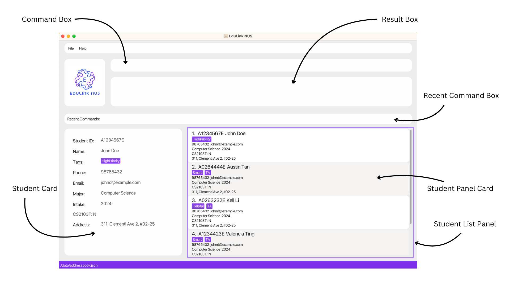

# EduLink-NUS User Guide

--------------------------------------------------------------------------------------------------------------------
## Introduction

Welcome to the **EduLink NUS User Guide** – your essential companion to unlocking the full potential of academic contact/ student management at the National University of Singapore (NUS). Designed specifically for professors and teaching assistants, EduLink NUS is a **desktop app for Academic Instructors to keep contacts of their past and current student, optimized for use via a Line Interface** (CLI) while still having the benefits of a Graphical User Interface (GUI). If you can type fast, EduLink NUS can get your contact management tasks done faster than traditional GUI apps.

In this comprehensive guide, you will discover everything you need to know to harness the capabilities of EduLink NUS effectively. From getting started with launching the application to exploring its myriad features and optimizing performance, each section is meticulously crafted to empower you in managing your academic interactions seamlessly.

Whether you're a seasoned user looking to enhance your workflow or a newcomer eager to dive into the world of efficient contact management, this User Guide is your roadmap to success with EduLink NUS. Let's embark on this journey together and unlock the full potential of academic engagement at NUS with EduLink NUS.

<!-- * Table of Contents -->

## Table of Contents

--------------------------------------------------------------------------------------------------------------------

- [Quick Start](#quick-start)
- [Features](#features)
    - [Viewing help: `help`](#viewing-help--help)
    - [Adding a student: `add`](#adding-a-student-add)
    - [Editing a student: `edit`](#editing-a-student--edit)
    - [Deleting a student: `delete`](#deleting-a-student--delete)
    - [Listing all students: `list`](#listing-all-students--list)
    - [Viewing a Student on the Student Card](#viewing-a-student-on-the-student-card)
    - [Search students by name or ID: `find`](#search-students-by-name-or-id-find)
    - [Filtering List of Students: `filter`](#filtering-list-of-students--filter)
    - [Adding or Editing Module Grade to a Student: `grade`](#adding-or-editing-module-grade-to-a-student--grade)
    - [Deleting Module Grade to a Student: `dgrade`](#deleting-module-grade-to-a-student--dgrade)
    - [Tagging a student: `tag`](#tagging-a-student--tag)
    - [Editing a student's tag: `etag`](#editing-tags-for-a-student-etag)
    - [Deleting a student's tag: `dtag`](#deleting-a-tag-from-a-student--dtag)
    - [Exporting students data: `export`](#exporting-students-data--export)
    - [Importing students data: `import`](#importing-students-data--import)
    - [Undo Changes: `undo`](#undo-changes-undo)
    - [Clearing all entries: `clear`](#clearing-all-entries--clear)
    - [Exiting the program: `exit`](#exiting-the-program--exit)
    - [Saving the data](#saving-the-data)
    - [Editing the data file](#editing-the-data-file)
- [FAQ](#faq)
- [Known issues](#known-issues)
- [Command summary](#command-summary)

--------------------------------------------------------------------------------------------------------------------

## Quick start

1. Ensure you have Java `11` installed in your Computer. Only that is supported

1. Download the latest `EduLink-NUS.jar` from [here](https://github.com/AY2324S2-CS2103T-T16-1/tp/releases).

1. Copy the file to the folder you want to use as the _home folder_ for your EduLink NUS.

1. Open a command terminal, `cd` into the folder you put the jar file in, and use the `java -jar EduLink-NUS.jar` command to run the application. 
   A GUI similar to the below should appear in a few seconds. Note how the app contains some sample data.  
      

1. Type the command in the command box and press Enter to execute it. e.g. typing **`help`** and pressing Enter will open the help window. 
   Some example commands you can try:

   * `list` : Lists all contacts.

   * `delete 3` : Deletes the 3rd contact shown in the current list.

   * `clear` : Deletes all contacts.

   * `exit` : Exits the app.

1. Refer to the [Features](#features) below for details of each command.

--------------------------------------------------------------------------------------------------------------------

## Graphical User Interface Layout

EduLink NUS's user interface can be split into 6 main components, as shown below:

The designated names assigned to each component of the User Interface will be consistently utilized throughout the User Guide to mitigate any potential confusion.
Please refer below for a comprehensive description of each component.

* Command Box: This is the designated space where users can input commands to be executed by EduLink NUS.
* Result Box: Located prominently on the interface, this box showcases the outcomes of executed commands.
* Recent Command Box: This section conveniently presents a history of recently executed commands for quick reference.
* Student List Panel: This panel serves as a visual representation of the roster of students stored within the EduLink NUS system.
  * Student Panel Card: Within the Student List Panel, each student is represented by a concise overview encapsulated in a card format.
* Student Card: For more detailed information about an individual student stored in the system, users can refer to the Student Card, providing comprehensive insights.

--------------------------------------------------------------------------------------------------------------------
## EduLink-NUS Features

<box type="info" seamless>

**General Notes about EduLink-NUS:** 

* Duplicate student entires is defined as 2 person who have identical `STUDENT_ID`.

* Unless explicitly stated otherwise, when indicating character limitations, spaces between words are counted within the total character count, while any leading or trailing spaces are not included in the calculation.

</box>

<box type="info" seamless>

**Notes about the command format:** 

* Commands are case-insensitive. e.g `filter` and `Filter` are the same command.

*  **TAB** key serve a distinct purpose and are not employed for creating four spaces.

* Words in `UPPER_CASE` are the parameters to be supplied by the user. 
  e.g. in `add n/NAME`, `NAME` is a parameter which can be used as `add n/John Doe`.

* Any parameter supplied by the user must not contain the **/** character as it serves a distinct purpose in out application. 

* Items in square brackets are optional. 
  e.g `n/NAME [t/TAG]` can be used as `n/John Doe t/TA` or as `n/John Doe`.

* Items with `…`​ after them can be used multiple times including zero times. 
  e.g. `[t/TAG]…​` can be used as ` ` (i.e. 0 times), `t/TA`, `t/TA t/Helpful` etc.

* Parameters can be in any order. 
  e.g. if the command specifies `n/NAME p/PHONE_NUMBER`, `p/PHONE_NUMBER n/NAME` is also acceptable.

* Extraneous parameters for commands that do not take in parameters (such as `help`, `list`, `exit` and `clear`) will be ignored. 
  e.g. if the command specifies `help 123`, it will be interpreted as `help`.

* The `INDEX` value must fall within the range of 1 to 2,147,483,647. Any value outside of this range will be deemed incorrect. Moreover, if the value falls within the specified range but is not found in the student list panel, it will be considered out of bounds.

* If you are using a PDF version of this document, be careful when copying and pasting commands that span multiple lines as space characters surrounding line-breaks may be omitted when copied over to the application.
</box>

### Viewing help : `help`

Shows a message explaning how to access the help page.

Format: `help`

* The format does not require any additional parameters; entering parameters will be disregarded.
* The help message image provided offers clear instructions for users seeking assistance.

### Adding a student: `add`

Adds a Student to the EduLink NUS.

Format: `add n/NAME id/STUDENT_ID p/PHONE_NUMBER e/EMAIL a/address in/INTAKE m/MAJOR [t/TAG]…​`

<box type="tip" seamless>

**Tip:** A student can have any number of tags (including 0)
</box>

* The `STUDENT_ID` must start with an alphabet followed by 7 digits and ending with an alphabet e.g. A0265901E.
* The `PHONE_NUMBER` must consist of only numeric characters and be at least longer than 3 digits. 
* The `INTAKE` must be a 4 digit positive number and cant be after the current year.
* The `TAG` must be less than 15 characters long with no space in between.

Examples:
* `add n/John Doe id/A2265901E p/1234567890 e/john.doe@example.com a/311, Clementi Ave 2, #02-25 in/2023 m/Computer Science t/Honors`

### Editing a student : `edit`

Edits an existing student in the address book, using the Student List Panel index. 

Format: `edit INDEX [id/STUDENT_ID] [n/NAME] [p/PHONE] [e/EMAIL] [a/ADDRESS] [m/MAJOR] [in/INTAKE]…​`

* Edits the student at the specified `INDEX`. The index refers to the index number shown in the Student List Panel. The index **must be a positive integer** 1, 2, 3, …​
* The `STUDENT_ID` must start with an alphabet followed by 7 digits and ending with an alphabet e.g. A0265901E.
* The `PHONE_NUMBER` must consist of only numeric characters and be at least longer than 3 digits.
* The `INTAKE` must be a 4 digit positive number and cant be after the current year.
* The `TAG` must be less than 15 characters with no space in between.
* At least one of the optional fields must be provided.
* Existing values will be updated to the input values.

Examples:
*  `edit 1 p/91234567 e/johndoe@example.com` Edits the phone number and email address of the 1st student to be `91234567` and `johndoe@example.com` respectively.
*  `edit 2 n/Betsy Crower in/2020` Edits the name of the 2nd student to be `Betsy Crower` and changes the intake to `2020`.

### Deleting a student : `delete`

Deletes a specified or a group of individual from the EduLink NUS system. Either through the student ID, Student List Panel index, or Student List Panel.

Format: `delete INDEX` **OR** `delete id/STUDENT_ID` **OR** `delete all`

* Deletes the student at the specified `INDEX` or deletes the student identified by the specified `STUDENT_ID`.
* The index refers to the index number shown in the Student List Panel.
* The `STUDENT_ID` refers to the unique identification string associated with individuals stored in EduLink NUS.
* The INDEX **must be a positive integer** 1, 2, 3, …​
* The STUDENT_ID **must exist within the system**
* Using the `all` keyword removes all the current students displayed within the Student List Panel from EduLink NUS.

Examples:
* `list` followed by `delete 2` deletes the 2nd student in the address book.
* `find Betsy` followed by `delete 1` deletes the 1st student in the results of the `find` command.
* `delete id/A026273X` deletes the student with Student ID A026273X, even if it is not currently on displayed on the Student List Panel.
* `filter t/TA` followed by `delete all` deletes all students with the `TA` tag. I.e. it removes all students currently displayed on the Student List Panel.

### Listing all students : `list`

Shows a list of all Students in the EduLink NUS.

Format: `list`

* Displays the list of all students stored within EduLink NUS on the Student List Panel.
* No parameters are required for this command, and any parameter added will be ignored.

### Viewing a Student on the Student Card:

View a single student's details in a formatted and organized manner.

Method: Left-click on a specific Student Panel Card within the Student List Panel of the EduLink NUS User Interface.

* The Student Card will display the currently selected student from the Student List Panel.
* The Student Card will display the details of the first student on the Student List Panel, when a specific student is not selected from the Student List Panel.
* The Student Card will update automatically to display the details of the first student on the Student List Panel whenever a command that alters the Student List Panel is executed. e.g. `delete`, `add`, `find`, `filter` ...
* If the Student List Panel is empty or becomes empty due to the execution of a command, the Student Card will display nothing.

### Accessing the Recent Commands in CommandBox:

Access the 5 most Recent Successful Commands in the CommandBox.

**Method 1 -  Using GUI**:
Left-Click with Mouse on the desired Recent Command (any one of the command marked with Red Rectangle).

**Method 2 -  Using CLI**:Press `TAB` on your Keyboard to access the RecentCommands in the order shown in the Image above
starting from left to right i.e (Most RecentCommand First)

### Search Students by Name or ID: `find`

This command facilitates the search for students in the EduLink NUS application based on their **Names**, **Student IDs**, or **Both**. Matching students will be displayed on the Student List Panel.

Formats: `find n/NAME`, `find id/STUDENT_ID`, **OR** `find n/NAME id/STUDENT_ID`

* The search is case-insensitive. e.g `john` will match `John`, `a1234567x` will match `A1234567X`
* The search by name supports partial word matching, but must be in chronological order e.g. `John` will match `Jonathan`. And `nathan` will not match with `Jonathan`.
* When searching by name with multiple words, only entries with the same chronological combination of the search words will match. It disregards the specific location of the match. e.g. `Li A` will successfully match `John Li An`.
  Additionally, `Hans Bo` will return `Hans Bober`, `Hans Bober` and not `Hans Mayer`
* The search by ID supports partial word matching and does not need to be in chronological order e.g. `A123` will match `A1234567X`. And `2345` will match with `A1234567X`.
* When searching by both ID and name, only entries with IDs and names that match both criteria will be returned.
 e.g. `Hans Bo` and `A1234` will return entries that has names that includes `Hans Bo` and IDs with `A1234`.

Examples:
* `find n/John` returns `john`, `John Doe`, `Johnathan`
* `find n/alex david` returns `Alex David`, `Alex Davidson`
* `find id/A1234567X` returns a person with ID `A12345678X`
* `find id/A123` returns entries with IDs with `A123`
* `find id/A1234567X n/John Doe` returns a person `John Doe` with ID `A12345678X`
* `find id/234 n/John D` returns a person `Jeff John Doe Leong` with ID `A12345678X`

### Filtering List of Students: `filter`

Filter displayed list of students on the Student List Panel based on a tag or tags.

Format: `filter t/TAG [t/TAG] …​`

* Tag names are case-insensitive. e.g `TA` will match `Ta`
* The order of the tags does not matter. e.g. result for `TA` and `Knowledgeable` will match `Knowledgeable` and `TA`.
* Only full words will be matched, no support for partial word matches. e.g. `TA` will not match `TAPotential`.
* Persons matching all tags listed will be returned. E.g. Person with `TA` tag only will not be returned, if tags
  specified includes `TA` and `Year 2`.

Examples:
* `filter t/CS2103T` will display only people that have been tagged with `CS2103T`.
* `filter t/CS2103T t/TA` wil display only people that have been tagged with `CS2103T` and `TA`.

### Adding or Editing Module Grade to a Student: `grade`

Adds a Module Grade for an individual from the EduLink NUS system, using the Student ID. 

Format: `grade id/STUDENT_ID mod/MODULE_CODE s/SCORE`

* Adds a Module Grade to a student identified by the specified STUDENT_ID.
* The `STUDENT_ID` refers to the alphanumeric string on the left of Name
* The `STUDENT_ID` must start with an alphabet followed by 7 digits and ending with an alphabet e.g A0265901E
* The `STUDENT_ID` must exist within the system
* The `MODULE_CODE` must be valid i.e. matches [2 letters] followed by [4 digits] then [an optional letter]
* The SCORE must be within 0 to 100. It will round values up to 2 deicimal places when displayed.
* Command will **edit** the grade of a specified module if `MODULE_CODE` already exists. 
* For each execution the Command can only **add** or **edit** a single module grade for one particular student.

Examples:
* `grade id/A0264273X mod/CS2103T s/77` grades the student with Student ID A0264273X for module CS2103T. 77 will be the displayed grade.
* `grade id/A0262743X mod/CS2103T s/85` edits the student with Student ID A0262743X's grade for module CS2103T because a grade for it already exists. 85 will be the displayed grade.

### Deleting Module Grade to a Student: `dgrade`

Deletes a Module Grade for an individual from the EduLink NUS system, using the Student ID.

Format: `dgrade id/STUDENT_ID mod/MODULE_CODE `

* Deletes a Module Grade for a student identified by the specified STUDENT_ID.
* The `STUDENT_ID` refers to the alphanumeric string on the left of Name
* The `STUDENT_ID` must start with an alphabet followed by 7 digits and ending with an alphabet e.g A0265901E
* The `STUDENT_ID` must exist within the system
* The `MODULE_CODE` must be valid i.e. matches [2 letters] followed by [4 digits] then [an optional letter]. 
* The `MODULE_CODE` must already exist for that particular student.
* For each execution the Command can only **delete** a single module grade entry for one particular student.

Examples:
* `dgrade` id/A026273X mod/CS2103T deletes the grade of the student with Student ID A026273X for module CS2103T.

### Tagging a student : `tag`

Tags the specified student from the address book.

Format: `tag id/STUDENT_ID t/TAG [t/TAG] …​`

* Adds a tag or multiple tags to the student with id `STUDENT_ID`.
* The `STUDENT_ID` refers to the alphanumeric string on the left of Name
* The `STUDENT_ID` must start with an alphabet followed by 7 digits and ending with an alphabet e.g A0265901E
* Each `TAG` can be alphanumeric.
* Each `TAG` must be less than 15 characters long with no space in between.

Examples:
* `tag id/A0257418E t/potentialTA t/Active`

### Editing tags for a Student: `etag`

Edits the tag of a specific student in EduLink NUS

Format: `etag id/STUDENT_ID t/EXISTING_TAG t/RESULTING_TAG`

* Edits the tag of the student with id `STUDENT_ID`.
* The `STUDENT_ID` refers to the alphanumeric string on the left of Name
* The `STUDENT_ID` must start with an alphabet followed by 7 digits and ending with an alphabet e.g A0265901E
* `EXISTING_TAG` must be alphabetic without spaces. It is the existing tag
that you intend to edit. This parameter must match exactly the current tag assigned to the student. Meaning it is case-sensitive.
* `RESULTING_TAG` is the new tag that will replace the existing TAG.
* Both the `EXISTING_TAG` and `RESULTING_TAG` must be less than 15 characters long with no space in between.

Examples:
* `etag id/A0265901E t/Honors t/Scholar` updates the tag from `Honors` to `Scholar` for the student with ID `A0265901E`.

### Deleting a tag from a student : `dtag`

Remove a list of specified tags from a student's profile.

Format: `dtag id/STUDENT_ID t/TAG [t/TAG] …​`

* Deletes a tags of the student with id `STUDENT_ID`.
* The `STUDENT_ID` refers to the alphanumeric string on the left of Name
* The `STUDENT_ID` must start with an alphabet followed by 7 digits and ending with an alphabet e.g A0265901E
* Each `TAG` is alphanumeric.
* Each `TAG` must be less than 15 characters long with no space in between.

Examples:
* `dtag id/A0257418E t/potentialTA t/Active`

### Exporting Students Data : `export`

Exports the students from the address book in a CSV file.

Format: `export f/[FILENAME]`

* Exports the Students Data in a CSV file named `FILENAME.csv` in the **exports** directory i.e `[JAR_FILE_LOCATION]/exports/FILENAME.csv`
* Multiple values within an attribute is separated with a `|` e.g Tags -> `Potenial TA | Honours` in the CSV File.
* `FILENAME` must be alphanumeric and it can include ` _ (Underscore)` and `- (Hyphen)`.

Examples:
* `export f/Mystudents`
* `export f/NUS-CS`

### Importing Students Data : `import`

Imports data from a valid JSON file into the Application

Format: `import f/[FILENAME]`

* Imports Students Data from JSON file named `FILENAME.json` in the **data** directory i.e `[JAR_FILE_LOCATION]/data/FILENAME.json`
* `FILENAME` must be alphanumeric and it can include ` _ (Underscore)` and `- (Hyphen)`.

Examples:
* `import f/Mystudents`
* `import f/NUS-CS`
* `import f/_Stanford`

### Undo Changes: `undo`

Undoes the last command executed and reverts the application to the previous state.

Format: `undo`

* The `undo` command revert the changes done by last data changing command i.e command that changes (add, edit or delete) information for any Student in the Application.
* The application stores up to 20 previous states, allowing you to undo up to the last 20 commands.
* If there are no commands to undo, an error message will be displayed saying No History available.

Examples:
* `undo`

### Clearing all entries : `clear`

Clears all entries from the address book.

Format: `clear`

### Exiting the program : `exit`

Exits the program.

Format: `exit`

### Saving the data

AddressBook data are saved in the hard disk automatically after any command that changes the data. There is no need to save manually.

### Editing the data file

AddressBook data are saved automatically as a JSON file `[JAR file location]/data/addressbook.json`. Advanced users are welcome to update data directly by editing that data file.

<box type="warning" seamless>

**Caution:**
If your changes to the data file makes its format invalid, AddressBook will discard all data and start with an empty data file at the next run.  Hence, it is recommended to take a backup of the file before editing it. 
Furthermore, certain edits can cause the AddressBook to behave in unexpected ways (e.g., if a value entered is outside the acceptable range). Therefore, edit the data file only if you are confident that you can update it correctly.
</box>

--------------------------------------------------------------------------------------------------------------------

## FAQ

**Q**: How do I transfer my data to another Computer? 
**A**: Install the app in the other computer and overwrite the empty data file it creates with the file that contains the data of your previous AddressBook home folder.

--------------------------------------------------------------------------------------------------------------------

## Known issues

1. **When using multiple screens**, if you move the application to a secondary screen, and later switch to using only the primary screen, the GUI will open off-screen. The remedy is to delete the `preferences.json` file created by the application before running the application again.

--------------------------------------------------------------------------------------------------------------------

## Command summary

Action     | Format, Examples
-----------|----------------------------------------------------------------------------------------------------------------------------------------------------------------------
**Add**    | `add n/NAME p/PHONE_NUMBER e/EMAIL a/ADDRESS [t/TAG]…​`   e.g., `add n/James Ho p/22224444 e/jamesho@example.com a/123, Clementi Rd, 1234665 t/friend t/colleague`
**Clear**  | `clear`
**Delete** | `delete INDEX` **OR** `delete id/STUDENT_ID` **OR** `delete all`   e.g., `delete 3`, `delete id/A026273X`, `delete all`
**Edit**   | `edit INDEX [n/NAME] [p/PHONE_NUMBER] [e/EMAIL] [a/ADDRESS] [t/TAG]…​`  e.g.,`edit 2 n/James Lee e/jameslee@example.com`
**Find**   | `find n/NAME`  **OR**  `find id/STUDENT_ID` **OR** `find n/NAME id/STUDENT_ID`   e.g. `find n/John`, `find id/A123`, `find id/234 n/John D`
**Filter** | `filter t/TAG [t/TAG] …​`  e.g., `filter t/CS2103T`, `filter t/CS2103T t/TA`
**Add Tag/Tags** | `tag id/ID t/TAG t/TAG`   e.g, `tag id/A0257418E t/potentialTA t/Active`
**List**   | `list`
**Undo**   | `undo`
**Export**   | `export f/FILENAME`   e.g, `export f/mystudents`
**Import**   | `import f/FILENAME`   e.g,`import f/NTU-CS`
**Delete tag/tags**   | `dtag id/STUDENT_ID t/TAG`   e.g,`dtag id/A0257418E t/potentialTA`
**Edit tag/tags** | `etag id/STUDENT_ID t/TAG t/RESULTING_TAG`   e.g `etag id/A0265901E t/Honors t/Scholar`
**Grade** | `grade id/STUDENT_ID mod/MODULE_CODE s/SCORE`   e.g `grade id/A0262733X mod/CS2103T s/77`
**Delete Grade** | `dgrade id/STUDENT_ID mod/MODULE_CODE`   e.g `dgrade id/A0262733X mod/CS2103T`
**Help**   | `help`
