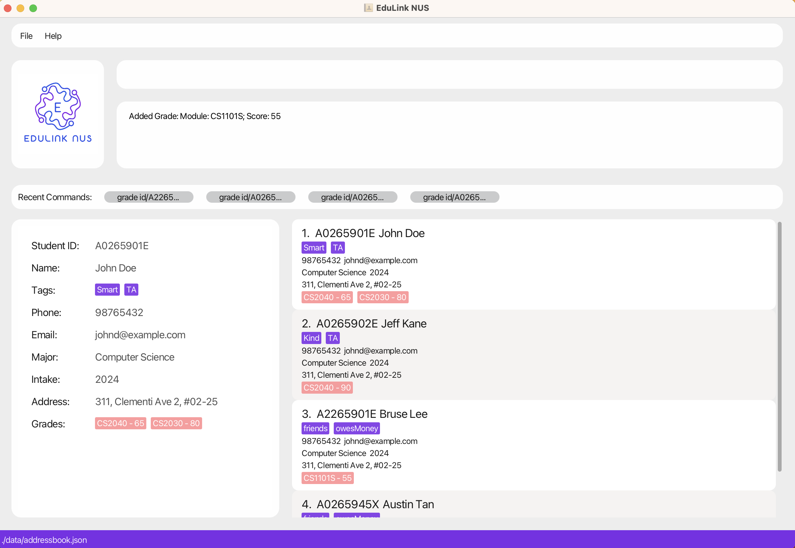
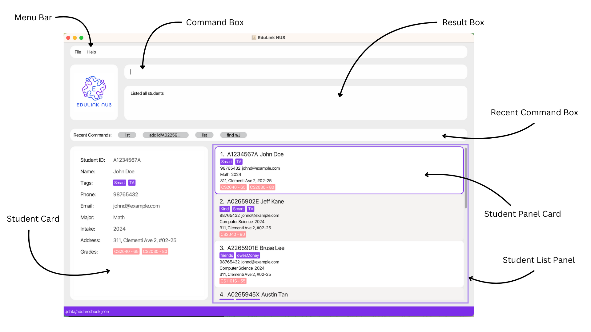
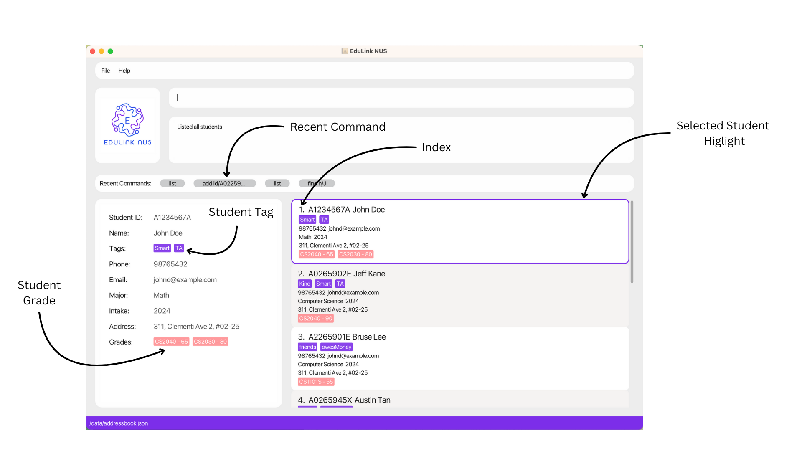
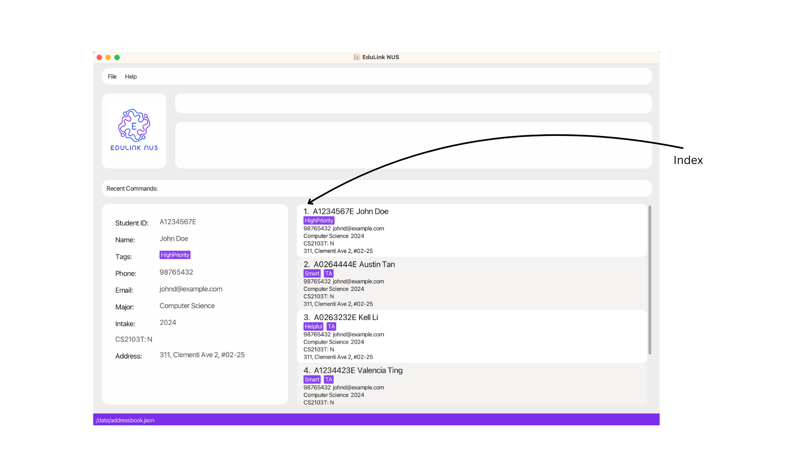
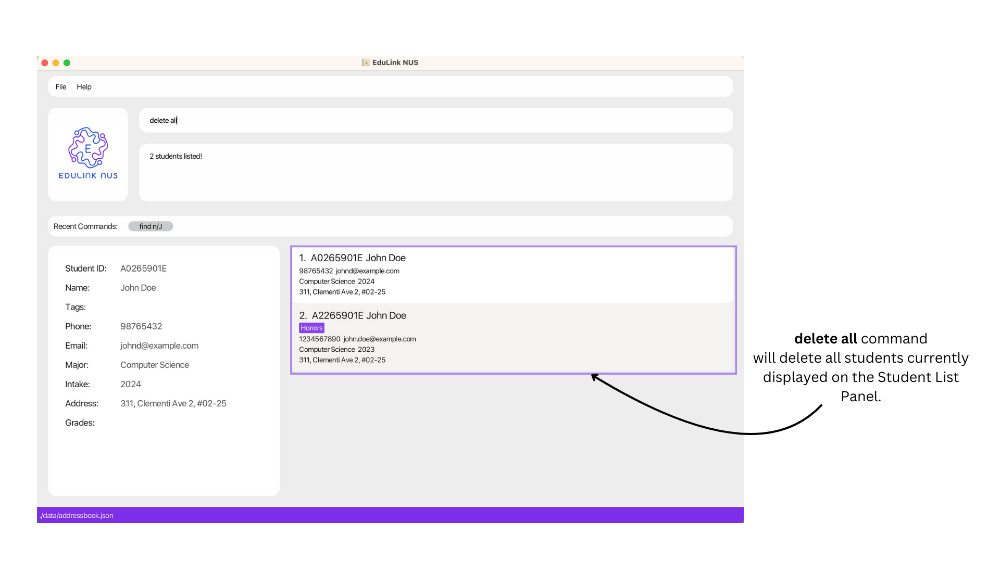
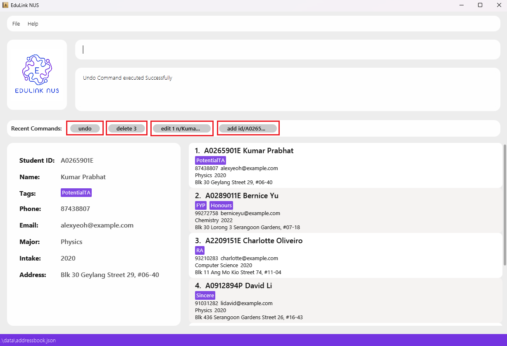

# EduLink-NUS User Guide

## Welcome to the EduLink-NUS User Guide!

Welcome to the **EduLink NUS User Guide** – your essential companion in unlocking the full potential of academic contacts and data management at the National University of Singapore (NUS).

In this comprehensive guide, we'll take you on a journey to harness the power of EduLink-NUS. But first, we would  like to extend a warm welcome and express our gratitude to you for choosing EduLink-NUS to enhance and improve your academic interactions.

--------------------------------------------------------------------------------------------------------------------
## Table of Contents

[1. Introduction](#introduction)
  - [1.1 What is EduLink-NUS](#what-is-edulink-nus)
  - [1.2 User Proficiency and Expectations](#user-proficiency-and-expectations)
  - [1.3 Why This Guide Matters](#why-this-guide-matters)

[2. How to use this User Guide](#how-to-use-this-user-guide)
  - [2.1 Navigating the Document](#navigating-the-document)
  - [2.2 Sections](#sections)
  - [2.3 Icons](#icons)

[3. Getting Started](#getting-started)
  - [3.1 Installation](#installation)
  - [3.2 Graphical User Interface Layout](#graphical-user-interface-layout)
    - [3.2.1 User Interface Overview](#user-interface-overview)
    - [3.2.2 Additional UI Components](#additional-ui-components)
  - [3.3 How to use EduLink-NUS commands](#how-to-use-edulink-nus-commands)
    - [3.3.1 Parameter Prefixes](#parameter-prefixes)
    - [3.3.2 Parameters](#parameters)
    - [3.3.3 Command Format](#command-format)

[4. Commands](#commands)
- [4.1 Data Modification Commands](#data-modification-commands)
  - [4.1.1 Adding a student: `add`](#adding-a-student-add)
  - [4.1.2 Editing a student: `edit`](#editing-a-student-edit)
  - [4.1.3 Deleting a student: `delete`](#deleting-a-student-delete)
  - [4.1.4 Adding or Editing a Module Score to a Student: `grade`](#adding-or-editing-a-module-score-to-a-student-grade)
  - [4.1.5 Deleting a Module Score for a Student: `dgrade`](#deleting-a-module-score-for-a-student-dgrade)
  - [4.1.6 Tagging a Student: `tag`](#tagging-a-student-tag)
  - [4.1.7 Editing tags for a Student: `etag`](#editing-tags-for-a-student-etag)
  - [4.1.8 Deleting a tag from a student: `dtag`](#deleting-a-tag-from-a-student-dtag)
- [4.2 Data Filtering Commands](#data-filtering-commands)
    - [4.2.1 Listing all students: `list`](#listing-all-students-list)
    - [4.2.2 Find Students by Name or ID: `find`](#find-students-by-name-or-id-find)
    - [4.2.3 Filtering List of Students: `filter`](#filtering-list-of-students-filter)
- [4.3 General Commands](#general-commands)
    - [4.3.1 Viewing a Student on the Student Card](#viewing-a-student-on-the-student-card)
    - [4.3.2 Accessing the Recent Commands](#accessing-the-recent-commands)
    - [4.3.3 Undo Changes: `undo`](#undo-changes-undo)
    - [4.3.4 Importing Students Data: `import`](#importing-students-data-import)
    - [4.3.5 Exporting Students Data: `export`](#exporting-students-data-export)
    - [4.3.6 Clearing all entries: `clear`](#clearing-all-entries-clear)
    - [4.3.7 Exiting the program: `exit`](#exiting-the-program-exit)
    - [4.3.8 Viewing help: `help`](#viewing-help-help)
- [4.4 Saving the Data](#saving-the-data)
- [4.5 Editing the Data File](#editing-the-data-file)

[5. FAQ](#faq)

[6. Known issues](#known-issues)

[7. Glossary](#glossary)

[8. Command summary](#command-summary)

--------------------------------------------------------------------------------------------------------------------
## 1. Introduction

### 1.1 What is EduLink-NUS

EduLink-NUS serves as a **desktop application tailored specifically for academic instructors** at the National University of Singapore (NUS). It is a powerful tool that can assists in **managing academic contacts and data**. With its purposefully designed Command Line Interface (CLI) and Graphical User Interface (GUI), users have no trouble in integrating it into workflows for efficient academic administration.

Overview of Main Features:
- Contact Management: Easily add, edit, and delete student entries, ensuring up-to-date information of students is always available.
- Module Grade Tracking: Record and manage module grades for individual students.
- Tagging System: Categorize students with custom tags for streamlined organization and quick retrieval of specific student groups.
- Export and Import Functionality: Seamlessly export student data to CSV files for external use and import data from JSON files for easier management of diverse organizational data.
- Undo Functionality: Safeguard against accidental changes with the ability to undo the last action.

### 1.2 User Proficiency and Expectations

- Level of Relatedness: Users of EduLink-NUS are assumed to have a direct relationship with NUS and are actively engaged in academic activities, including teaching, student mentoring, and administrative tasks related to student management.

- Comprehension: Users of EduLink-NUS are assumed to have a strong comprehension of academic terminology and procedures used within NUS. They are familiar with concepts such as student IDs and the module grading system.

- Prior Knowledge: Users of EduLink-NUS are assumed to possess prior knowledge of computer applications and basic technical skills necessary to navigate software interfaces.

- Desire for Efficiency: Users of EduLink-NUS prioritize efficiency and productivity in their academic administration tasks.

### 1.3 Why This Guide Matters

This guide is more than just a manual, it is a gateway to maximize your experience with EduLink-NUS. By following the instructions and insights provided here, you'll discover shortcuts, tips, and strategies to streamline your workflow and enhance productivity. Whether you're a seasoned user or just getting started, this guide will equip you with the knowledge and skills to leverage EduLink-NUS effectively.

We're excited to embark on this journey with you and help you make the most out of your academic engagement at NUS with EduLink-NUS. So let's dive in and unleash the full potential of EduLink-NUS together!

--------------------------------------------------------------------------------------------------------------------
## 2. How to use this User Guide

This section is designed to help users effectively navigate the User Guide for EduLink-NUS. Below, you'll find information on how to interpret icons, formatting, and instructions provided throughout the document.

### 2.1 Navigating the Document:

- **Table of Contents:** Located at the beginning of the document, the Table of Contents provides an overview of the topics covered. Users can click on any section title to jump directly to that part of the guide.

- **Section Organization:** Each section is organized with headings and subheadings, breaking down information into manageable chunks. Users can easily locate specific topics or commands by scanning through the contents.

### 2.2 Sections:

Below is a detailed overview of the main sections within this User Guide and what can be expected from each section.

- [Installation](#installation): If you're new to EduLink-NUS or require guidance on installing the application, navigate to this section for step-by-step instructions.

- [Getting Started](#getting-started): Designed for beginners, this section provides an introductory overview of EduLink-NUS, covering essential information such as the [Layout](#graphical-user-interface-layout) and [Command format](#command-format).

- [Commands](#commands): Section of the User Guide that delves into the intricacies of EduLink-NUS commands, it is here where you'll find detailed explanations and practical examples for effective command usage.

- [Command Summary](#command-summary): For experienced users seeking a quick reference, this section offers a concise summary of all supported commands.

- [FAQ](#faq): Should you encounter any queries or uncertainties while using the application, refer to this section for answers to frequently asked questions.

<box type="info" seamless>
For first-time users of the application, it is highly recommended for you to read through the Getting Started section before utilizing the application.
</box>

### 2.3 Icons:

As you navigate through this user guide, you'll encounter colored boxes containing valuable insights. Each box is adorned with an icon, indicating the type of information it holds.

| Icon                                   | Meaning                                                      |
|----------------------------------------|--------------------------------------------------------------|
| <box type="tip" seamless> </box>       | Tips to help you make the most out of EduLink-NUS.           |
| <box type="info" seamless> </box>      | Information you should take note of while using EduLink-NUS.     |
| <box type="warning" seamless>   </box> | Warnings that may corrupt your app and data if not followed. |

--------------------------------------------------------------------------------------------------------------------
## 3. Getting Started

### 3.1 Installation

1. Ensure you have Java `11` installed in your Computer. EduLink-NUS is optimized for this version, and while it may function on other versions, we cannot guarantee smooth operation outside of Java 11.

1. Download the latest `EduLink-NUS.jar` from [here](https://github.com/AY2324S2-CS2103T-T16-1/tp/releases).

1. Copy the file to the folder you want to use as the _home folder_ for your EduLink NUS.

1. Open a command terminal, `cd` into the folder you have placed the jar file in, and enter the `java -jar EduLink-NUS.jar` command to run the application.  
   A GUI similar to the below should appear in a few seconds. Note that the application will contain some sample data.  
      
   <box type="info" seamless> To remove the sample data quickly, you can use the [`clear`](#clearing-all-entries-clear) command.</box>   

1. Type the command in the command box and press Enter to execute it. e.g. typing **`help`** and pressing Enter will open the help window. 
   Some example commands you can try:

   * `list` : Lists all contacts.

   * `delete 3` : Deletes the 3rd contact shown in the current list.

   * `clear` : Deletes all contacts.

   * `exit` : Exits the app.

1. Refer to the [Command Section](#commands) below for details of all commands supported by EduLink-NUS. Alternatively, refer to the [Command Summary](#command-summary) for a quick summary.

### 3.2 Graphical User Interface Layout:

#### 3.2.1 User Interface Overview:

EduLink NUS's user interface can be split into 7 main components, as shown below:

The designated names assigned to each component of the User Interface will be consistently utilized throughout the User Guide to mitigate any potential confusion.
Please refer below for a comprehensive description of each component.

* Menu Bar:  Located at the top of the interface, the menu bar provides access to various functions and features within EduLink NUS.
* Command Box: This is the designated space where users can input commands to be executed by EduLink NUS.
* Result Box: Located prominently on the interface, this box showcases the outcomes of executed commands.
* Recent Command Box: This section conveniently presents a history of recently executed commands for quick reference. The ordering in the Recent Command Box goes from left to right, with the most recent executed command appearing on the left.
* Student List Panel: This panel serves as a visual representation of the roster of students stored within the EduLink NUS system.
  * Student Panel Card: Within the Student List Panel, each student is represented by a concise overview encapsulated in a card format.
* Student Card: For more detailed information about an individual student stored in the system, users can refer to the Student Card, providing comprehensive insights.

#### 3.2.2 Additional UI Components:

* Recent Command: Highlighted in gray, this component stores a previously successfully executed command.
* Index: This component indicates the position of each student in the Student List Panel.
* Student Tag: Highlighted in purple, the Student Tag appears in both the Student Card and Student Panel Card. Each student can have multiple tags associated with them.
* Student Grade: Highlighted in pink, the Student Grade appears in both the Student Card and Student Panel Card, providing information about the academic performance of each student. Like tags, students can have multiple grades associated with them.
* Selected Student Highlight: Highlighted with a purple outline, this component indicates the selected Student Panel Card for viewing in the Student Card.

### 3.3 How to use EduLink-NUS commands:

EduLink-NUS operates primarily through text-based commands. Before we explore the specific commands in detail in the Commands section, let’s familiarize ourselves with the basic components and format of a command.

#### 3.3.1 Parameter Prefixes:

In EduLink-NUS, a parameter prefix acts as a delimiter for specifying different types of parameters in commands. Here's a reference table for common parameter prefixes and their corresponding parameters:

| Parameter Prefix | Corresponding Parameter |
|------------------|-------------------------|
| `id/`            | `STUDENT_ID`            |
| `n/`             | `NAME`                  |
| `p/`             | `PHONE_NUMBER`          |
| `e/`             | `EMAIL`                 |
| `a/`             | `ADDRESS`               |
| `m/`             | `MAJOR`                 |
| `in/`            | `INTAKE`                |
| `t/`             | `TAG`                   |
| `mod/`           | `MODULE`                |
| `s/`             | `MODULE_SCORE`          |
| `f/`             | `FILENAME`              |

#### 3.3.2 Parameters:

In EduLink-NUS, a parameter represents a placeholder where users input data. Parameters typically follow immediately after their corresponding Parameter Prefixes. Essentially they are to be supplied by the user.

Each parameter has unique constraints, which restrict what users can input for the parameter. Refer to the table below for details.

<box type="info" seamless>
Some parameters to not come along with their own Parameter Prefix. E.g. KEYWORD and INDEX.
</box>

| Parameter      | Parameter Prefix | Description                                                                                                                                                                                                                                                                                                                                                                                                                                                                                                                                                                                                                                                                        |
|----------------|------------------|------------------------------------------------------------------------------------------------------------------------------------------------------------------------------------------------------------------------------------------------------------------------------------------------------------------------------------------------------------------------------------------------------------------------------------------------------------------------------------------------------------------------------------------------------------------------------------------------------------------------------------------------------------------------------------|
| `STUDENT_ID`   | `id/`            | Specifies the Student ID of a student.    - IDs must contain only alphanumeric characters.   - The ID must start with a letter, followed by exactly 7 digits, and end with a letter.                                                                                                                                                                                                                                                                                                                                                                                                                                                                                   |
| `NAME`         | `n/`             | Specifies the Name of a student.    - Names must contain only alphanumeric characters , whitespaces and pipe character i.e. `\|`    - The name must start with a letter.   - Names are restricted to a 100 characters long.                                                                                                                                                                                                                                                                                                                                                                                                                                          |
| `PHONE_NUMBER` | `p/`             | Specifies the Phone Number of a student.    - Phone numbers must contain only numerical digits.   - Phone numbers must be at least 3 digits long.   - Phone numbers are restricted to 15 digits.                                                                                                                                                                                                                                                                                                                                                                                                                                                                   |
| `EMAIL`        | `e/`             | Specifies the Email of a student.    - Emails should be of the format `local-part@domain`.   - local-part should only contain alphanumeric characters and these characters: `+` `_` `.` `-`    - The local-part must be followed by a '@' and then a domain name.   -  The domain name is made up of domain labels separated by periods.   - The domain name must end with a domain label at least 2 characters long.   - Each domain label must start and end with alphanumeric characters.   -  Each domain label consists of alphanumeric characters, separated only by hyphens, if any.   - Emails are restricted to a 100 characters long. |
| `ADDRESS`      | `a/`             | Specifies the Address of a student.    - Addresses can contain only alphanumeric characters, whitespaces, and the following special characters: `,` `#` `-`.    - Addresses are restricted to a 100 characters long.                                                                                                                                                                                                                                                                                                                                                                                                                                                   |
| `MAJOR`        | `m/`             | Specifies the Major of a student.    - Majors must contain only alphabetical characters and whitespaces.    - Majors are restricted to 50 characters long.                                                                                                                                                                                                                                                                                                                                                                                                                                                                                                             |
| `INTAKE`       | `in/`            | Specifies the Intake of a student.    - Intake should contain Year in the form YYYY.   - Intakes can't be after the current year.                                                                                                                                                                                                                                                                                                                                                                                                                                                                                                                                      |
| `TAG`          | `t/`             | Specifies the tag to categorize a student under.    - Tags names should be alphanumeric.   - Tags are restricted to 20 characters long.                                                                                                                                                                                                                                                                                                                                                                                                                                                                                                                                |
| `MODULE`       | `mod/`           | Specifies the module code of an associated grade score for a student.    - Module code should only contain alphanumeric characters starting with minimum 2 to maximum 4 letters. Followed by 4 digits and may end with an optional letter.                                                                                                                                                                                                                                                                                                                                                                                                                                 |
| `MODULE_SCORE` | `s/`             | Specifies the module score for an associated module grade for a student.    - Module score should be a non-negative number between 0 and 100 inclusive.                                                                                                                                                                                                                                                                                                                                                                                                                                                                                                                    |
| `FILENAME`     | `f/`             | Specifies the file to import or export from.    - Filenames can only contain alphanumeric characters and the special characters: `-` and `_`.                                                                                                                                                                                                                                                                                                                                                                                                                                                                                                                              |
| `KEYWORD`      | Not Applicable   | Specifies the keywords to search for when finding students.     - Can contain alphanumeric characters and any special characters, except the special character: `/`. No whitespaces allowed.                                                                                                                                                                                                                                                                                                                                                                                                                                                                               |
| `INDEX`        | Not Applicable   | Refers to the index number shown in the Student List Panel.     -  Must be a positive whole number, e.g. 1, 2, 3. And fall withing the range of 1 to 2,147,483,647.                                                                                                                                                                                                                                                                                                                                                                                                                                                                                                        |

<box type="info" seamless>
System date can be modified as to allow for `INTAKE` to be of any year after the current year.
</box>

#### 3.3.3 Command Format:

To understand how a full command is interpreted, we will utilise the following example.

**Example:** `add n/NAME id/STUDENT_ID p/PHONE_NUMBER e/EMAIL a/ADDRESS in/INTAKE m/MAJOR [t/TAG]…​`

|             | Component Name    | Meaning                                                        |
|-------------|-------------------|----------------------------------------------------------------|
| **`add`**   | Command           | Will result in the execution of the Add Command by EduLink-NUS |
| **`n/`**    | Parameter Prefix  | Distinguishes `NAME` from other input fields.                  |
| **`NAME`**  | Parameter         | Represents placeholder for name of the student.                |

Certainly, here's a revised version:

You'll notice that `[TAG]` is wrapped in square brackets, indicating that it's an optional component.

- For example, in `n/STUDENT_NAME [TAG]`, you can include a tag like `n/John t/TA` or simply input the student's name as `n/John`.

Moreover, notice that `[TAG]` is followed by an ellipsis (`…`). This signifies that items followed by an ellipsis can be entered multiple times, including zero times.

- As an illustration, `n/STUDENT_NAME [TAG]…` can be used with no tags at all, like `n/John`, or with multiple tags, such as `n/John t/Math t/TA`.

<box type="info" seamless>

**General Notes about EduLink-NUS:** 

* Duplicate student entires is defined as 2 person who have identical `STUDENT_ID`.

* All the previous History for `undo` will be cleared after you exit the Application i.e. You can't undo a Command if you exit EduLink-NUS and Start again.

* All Recent Commands will be cleared after you exit the Application i.e. You can't fetch recent commands if you exit EduLink-NUS and start again.

* Unless explicitly stated otherwise, when indicating character limitations, spaces between words are counted within the total character count, while any leading or trailing spaces are not included in the calculation.

</box>

<box type="info" seamless>

**Notes about the command format:** 

* Commands are case-insensitive. e.g `filter` and `Filter` are the same command.

* Words in `UPPER_CASE` are the parameters to be supplied by the user. 
  e.g. in `add n/NAME`, `NAME` is a parameter which can be used as `add n/John Doe`.

* Items in square brackets are optional. 
  e.g `n/NAME [t/TAG]` can be used as `n/John Doe t/TA` or as `n/John Doe`.

* Items with `…`​ after them can be used multiple times including zero times. 
  e.g. `[t/TAG]…​` can be used as ` ` (i.e. 0 times), `t/TA`, `t/TA t/Helpful` etc.

* Parameters can be in any order. 
  e.g. if the command specifies `n/NAME p/PHONE_NUMBER`, `p/PHONE_NUMBER n/NAME` is also acceptable.

* Extraneous parameters for commands that do not take in parameters (such as `help`, `list`, `exit` and `clear`) will be ignored. 
  e.g. if the command specifies `help 123`, it will be interpreted as `help`.

* The `INDEX` value must fall within the range of 1 to 2,147,483,647. Any value outside of this range will be deemed incorrect. Moreover, if the value falls within the specified range but is not found in the student list panel, it will be considered out of bounds.

* If you are using a PDF version of this document, be careful when copying and pasting commands that span multiple lines as space characters surrounding line-breaks may be omitted when copied over to the application.
</box>

<box type="warning" seamless>

**IMPORTANT !!!** 

* **TAB** key serve a distinct purpose and should now be utilised for creating four whitespaces.

* Any parameter supplied by the user must not contain the **/** character as it serves a distinct purpose in the application.
</box>

--------------------------------------------------------------------------------------------------------------------
## 4. Commands

This section provides comprehensive guidance on how to use each command, detailing their functionalities and usage scenarios. For specific constraints related to each parameter, please refer to the [Parameter](#parameters) section for detailed information

### 4.1 Data Modification Commands:

#### 4.1.1 Adding a student: `add`

> Adds a Student to the EduLink-NUS application.

Format: `add n/NAME id/STUDENT_ID p/PHONE_NUMBER e/EMAIL a/ADDRESS in/INTAKE m/MAJOR [t/TAG]…​`

<box type="tip" seamless>
<b>Tip:</b> A student can have any number of tags (including 0)
</box>

<box type="warning" seamless>
System date can be modified as to allow for `INTAKE` to be of any year after the current year.
</box>

Command Details & Constraints:
* Adds a new student data to the EduLink-NUS application. Will be located at the end of the Student List Panel.
* Command will only be executed, if there is no preexisting student data within the EduLink-NUS application with the same `STUDENT_ID`.
* All parameters must satisfy their corresponding [parameter constraints](#parameters).

Examples:
* `add n/John Doe id/A2265901E p/1234567890 e/john.doe@example.com a/311, Clementi Ave 2, #02-25 in/2023 m/Computer Science t/Honors`
* `add n/John Doe id/A2265901E p/1234567890 e/john.doe@example.com a/311, Clementi Ave 2, #02-25 in/2023 m/Computer Science t/Honors t/TA`

#### 4.1.2 Editing a student: `edit`

> Edits an existing student in the EduLink-NUS application.

Format: `edit INDEX [id/STUDENT_ID] [n/NAME] [p/PHONE] [e/EMAIL] [a/ADDRESS] [m/MAJOR] [in/INTAKE]​`

<box type="info" seamless>
<b>Info:</b> For the command to be valid. At least one Parameter Prefix and its corresponding parameter must be provided.
</box>

Command Details & Constraints:
* Edits the student at the specified `INDEX`. The index refers to the index number shown in the Student List Panel.
* At least one of the optional fields must be provided.
* Existing values will be updated with the input parameter values.
* All parameters must satisfy their corresponding [parameter constraints](#parameters).

Examples:
*  `edit 1 p/91234567 e/johndoe@example.com` Edits the phone number and email address of the 1st student on the Student List Panel to be `91234567` and `johndoe@example.com` respectively.
*  `edit 2 n/Betsy Crower in/2020` Edits the name of the 2nd student to be `Betsy Crower` and changes the intake to `2020`.

#### 4.1.3 Deleting a student: `delete`

> Deletes a specified or a group of students from the EduLink-NUS Application.

Format: `delete INDEX` **OR** `delete id/STUDENT_ID` **OR** `delete all`

Command Details & Constraints:
* Able to delete an individual student through:
  1. A specified `INDEX` associated with a student displayed in the Student List Panel.
  2. A specified `STUDENT_ID` within the EduLink-NUS Application. This allows the deletion of students outside the Student List Panel.
     * The `STUDENT_ID` must exist within the system.
* Able to delete a group of students through:
  1. The case-insensitive `delete all` command. It deletes all students currently displayed on the Student List Panel.
* All parameters must satisfy their corresponding [parameter constraints](#parameters).

Examples:
* `list` followed by `delete 2` deletes the 2nd student in the address book.
* `find Betsy` followed by `delete 1` deletes the 1st student in the results of the `find` command.
* `delete id/A026273X` deletes the student with Student ID A026273X, even if it is not currently on displayed on the Student List Panel.
* `filter t/TA` followed by `delete all` deletes all students with the `TA` tag. I.e. it removes all students currently displayed on the Student List Panel.

#### 4.1.4 Adding or Editing a Module Score to a Student: `grade`

> Add and Edit a student's Module Score in the EduLink-NUS application.

Format: `grade id/STUDENT_ID mod/MODULE s/SCORE`

<box type="info" seamless>
<b>Info:</b> For the command to be valid. The student specified by the `STUDENT_ID` must be displayed in the Student List Panel. This is to ensure data integrity is maintained and prevent any accidental changes.
</box>

Command Details & Constraints:
* Adds a Module Score to a student specified by the `STUDENT_ID`.
  * The specified student via `STUDENT_ID` must be displayed on the Student List Panel.
* Command will **edit** the score of a specified module if `MODULE` already exists.
* For each execution, the command can only **add** or **edit** a single module score for a particular student.
* All parameters must satisfy their corresponding [parameter constraints](#parameters).

Examples:
* `grade id/A0265901E mod/CS2103T s/77.5` grades the student with Student ID A0265901E for module CS2103T if found in the filtered list. 77.5 will be the displayed grade.
* `grade id/A0265901E mod/CS2103T s/77.5` then `grade id/A0265901E mod/CS2103T s/85` edits the student with Student ID A0262743X's grade for module CS2103T because a grade for it already exists. 85 will be the displayed grade.

#### 4.1.5 Deleting a Module Score for a Student: `dgrade`

> Deletes a Module Score for a student in the EduLink-NUS application.

Format: `dgrade id/STUDENT_ID mod/MODULE`

<box type="info" seamless>
<b>Info:</b> For the command to be valid. The student specified by the `STUDENT_ID` must be displayed in the Student List Panel. This is to ensure data integrity is maintained and prevent any accidental changes.
</box>

Command Details & Constraints:
* Deletes a Module Score for a student specified by the specified `STUDENT_ID`.
  * The specified student via `STUDENT_ID` must be displayed on the Student List Panel.
* The `MODULE` must already exist for that particular student.
* For each execution, the command can only **delete** a single module grade entry for one particular student.
* All parameters must satisfy their corresponding [parameter constraints](#parameters).

Examples:
* `dgrade id/A026273X mod/CS2103T` deletes the grade of the student with Student ID A026273X for module CS2103T.

#### 4.1.6 Tagging a Student: `tag`

> Tags a specified student in the EduLink-NUS application.

Format: `tag id/STUDENT_ID t/TAG [t/TAG] …​`

<box type="info" seamless>
<b>Info:</b> For the command to be valid. The student specified by the `STUDENT_ID` must be displayed in the Student List Panel. This is to ensure data integrity is maintained and prevent any accidental changes.
</box>

<box type="tip" seamless>
**Tip:** You can tag the specified student with any number of `TAG`s.
</box>

Command Details & Constraints:
* Adds a tag or multiple tags to the student with id `STUDENT_ID`.
  * The specified student via `STUDENT_ID` must be displayed on the Student List Panel.
* `TAG` is case-insensitive: TA and ta are the same.
  * EduLink-NUS prevents the entry of duplicated tags.
* All parameters must satisfy their corresponding [parameter constraints](#parameters).

Examples:
* `tag id/A0257418E t/potentialTA`
* `tag id/A0257418E t/potentialTA t/Active`

#### 4.1.7 Editing tags for a Student: `etag`

> Edits the tag of a specific student in the EduLink-NUS application.

Format: `etag id/STUDENT_ID t/EXISTING_TAG t/RESULTING_TAG`

<box type="info" seamless>
<b>Info:</b> For the command to be valid. The student specified by the `STUDENT_ID` must be displayed in the Student List Panel. This is to ensure data integrity is maintained and prevent any accidental changes.
</box>

Command Details & Constraints:
* Edits the tag of the student with id `STUDENT_ID`.
  * The specified student via `STUDENT_ID` must be displayed on the Student List Panel.
* `EXISTING_TAG` is the existing tag that you intend to edit. It is case-insensitive.
* `RESULTING_TAG` is the new tag that will replace the existing tag.
* Both the `EXISTING_TAG` and `RESULTING_TAG` must be not more than 15 characters long with no space in between.
* Both the `EXISTING_TAG` and `RESULTING_TAG` much be alphanumeric, and they are case-insensitive.
* For each execution, the command can only **edit** a single tag for one particular student.

Examples:
* `etag id/A0265901E t/Honors t/Scholar` updates the tag from `Honors` to `Scholar` for the student with ID `A0265901E`.

#### 4.1.8 Deleting a tag from a student: `dtag`

> Remove a list of specified tags for a particular student in the EduLink-NUS application.

Format: `dtag id/STUDENT_ID t/TAG [t/TAG] …​`

<box type="info" seamless>
<b>Info:</b> For the command to be valid. The student specified by the `STUDENT_ID` must be displayed in the Student List Panel. This is to ensure data integrity is maintained and prevent any accidental changes.
</box>

Command Details & Constraints:
* Deletes specified tags of the student with id `STUDENT_ID`.
  * The specified student via `STUDENT_ID` must be displayed on the Student List Panel.
* `TAG` is case-insensitive: TA and ta are the same.
* All parameters must satisfy their corresponding [parameter constraints](#parameters).

Examples:
* `dtag id/A0257418E t/potentialTA t/Active` deletes tags `potentialTA` and `Active` for the student with the Student ID `A0257418E`.

### 4.2 Data Filtering Commands:

#### 4.2.1 Listing all students: `list`

> Shows a list of all Students in the EduLink-NUS application.

Format: `list`

Command Details & Constraints:
* Displays the list of all students stored within EduLink NUS on the Student List Panel.
* No parameters are required for this command, and any parameter added will be ignored.

#### 4.2.2 Find Students by Name or ID: `find`

> This command facilitates the search for students in the EduLink-NUS application based on their **Names**, **Student IDs**, or **Both**.

Formats: `find n/KEYWORD [KEYWORD] …​` **OR** `find id/KEYWORD` **OR** `find n/KEYWORD [KEYWORD] …​ id/KEYWORD`

Command Details & Constraints:
* The parameter prefix `n/` is used to search by **Name**. The parameter prefix `id/` is used to search by **Student ID**.
* Students who meet the specified criteria will be displayed on the Student List Panel.
* The search is case-insensitive. e.g `john` will match `John`, `a1234567x` will match `A1234567X`.
* **Searching by Name - Single Keyword:**
  * Partial word matching is supported when searching by a single `KEYWORD`, but matches must commence from the first letter.
  * E.g. `John` will match `Jonathan`. And `nathan` will not match with `Jonathan`.
* **Searching by Name - Multiple Keywords:**
  * Only Student Names which contains the same chronological combination and ordering of those `KEYWORD`s will be returned.
  * Specific location of the match is disregarded.
  * Only the last `KEYWORD` will allow for partial word matching, but matches must commence from the first letter.
  * E.g. `Li A` will successfully match `John Li An`. Additionally, `Hans Bo` will return `Hans Bober`, `Hans Bober` and not `Hans Mayer`
* **Searching by ID:**
  * Partial word matching is supported and matches need not commence from the first letter.
  * E.g. `A123` will match `A1234567X`. And `2345` will match with `A1234567X`.
* **Searching by both ID & Name:**
  * Only entries with IDs and names that match both criteria will be returned.
  * The constraints for matches, both for Name and ID, are applied the same as when searching by Name and ID individually.
  * E.g. `Hans Bo` and `A1234` will return entries that has names that includes `Hans Bo` and IDs with `A1234`.

Examples:
* `find n/John` returns `john`, `John Doe`, `Johnathan`
* `find n/alex david` returns `Alex David`, `Alex Davidson`
* `find id/A1234567X` returns a person with ID `A12345678X`
* `find id/A123` returns entries with IDs with `A123`
* `find id/A1234567X n/John Doe` returns a person `John Doe` with ID `A12345678X`
* `find id/234 n/John D` returns a person `Jeff John Doe Leong` with ID `A12345678X`

#### 4.2.3 Filtering List of Students: `filter`

> Filters all students based on tags in the EduLink-NUS application.

Format: `filter t/TAG [t/TAG] …​`

Command Details & Constraints:
* Students who meet the specified criteria will be displayed on the Student List Panel.
* Tag names are case-insensitive. e.g `TA` will match `Ta`
* The order of the tags does not matter. e.g. result for `TA` and `Knowledgeable` will match `Knowledgeable` and `TA`.
* Only full words will be matched, no support for partial word matches. e.g. `TA` will not match `TAPotential`.
* Persons matching all tags listed will be returned. E.g. Person with `TA` tag only will not be returned, if tags
  specified includes `TA` and `Year 2`.

Examples:
* `filter t/CS2103T` will display only people that have been tagged with `CS2103T`.
* `filter t/CS2103T t/TA` wil display only people that have been tagged with `CS2103T` and `TA`.

### 4.3 General Commands:

#### 4.3.1 Viewing a Student on the Student Card:

> View a single student's details in a formatted and organized manner.

**Method 1 -  Using GUI**: Left-click on a specific Student Panel Card within the Student List Panel of the EduLink-NUS User Interface.

**Method 2 -  Using CLI**: Navigate using the up and down arrow keys to switch between Student Panel Cards on the Student List Panel.

Command Details & Constraints:
* The Student Card will always display the currently selected Student Panel Card from the Student List Panel. The currently selected Student Panel Card is highlighted in purple.
* The Student Card will display the details of the first student on the Student List Panel, when a specific student is not selected from the Student List Panel.
* The Student Card will update automatically to display the details of the first student on the Student List Panel whenever a command that alters the data within Student List Panel is executed. e.g. `delete`, `add`, `find`, `filter`, `edit`, `tag` ...
* If the Student List Panel is empty or becomes empty due to the execution of a command, the Student Card will display nothing.

#### 4.3.2 Accessing the Recent Commands:

> Access the 5 most recent successfully executed commands.

**Method 1 -  Using GUI**: Left-Click with Mouse on the desired Recent Command (any one of the command marked with Red Rectangle).

**Method 2 -  Using CLI**: Press `TAB` on your Keyboard to access the RecentCommands in the order shown in the Image above starting from left to right i.e (Most RecentCommand First)

Command Details & Constraints:
* The selected command will be copied into the command box for use.

#### 4.3.3 Undo Changes: `undo`

> Undoes the last command executed and reverts the application to the previous state.

Format: `undo`

Command Details & Constraints:
* The `undo` command revert the changes done by last **Data changing command** i.e. command that changes (adds, edits or deletes) information for any Student in the Application.
* The application stores up to 20 previous states, allowing you to undo up to the last 20 commands.
* If there are no commands to undo or else you already executed `undo` for 20 commands, an error message will be displayed.
* 

Examples:
* `undo`

#### 4.3.4 Importing Students Data: `import`

> Imports data from a valid JSON file into the EduLink-NUS application.

Format: `import f/[FILENAME]`

Command Details & Constraints:
* Imports Students Data from JSON file named `FILENAME.json` in the **data** directory i.e `[JAR_FILE_LOCATION]/data/FILENAME.json`.
* The `FILENAME` parameter must satisfy its corresponding [parameter constraints](#parameters).
  * Filenames can only contain alphanumeric characters and the special characters: `-`and `_`.
* An error message will be displayed when there is an attempt to import an invalid JSON file.

Examples:
* `import f/Mystudents`
* `import f/NUS-CS`
* `import f/_Stanford`

#### 4.3.5 Exporting Students Data: `export`

> Exports the students from the EduLink-NUS application to a CSV file.

Format: `export f/[FILENAME]`

Command Details & Constraints:
* Exports the Students Data in a CSV file named `FILENAME.csv` in the **exports** directory i.e `[JAR_FILE_LOCATION]/exports/FILENAME.csv`
* Multiple values within an attribute is separated with a `|`.
  * E.g. Tags: `Potenial TA | Honours` in the CSV File.
  * E.g. Grades: `CS2030 - 80 | CS2040 - 78` in the CSV File.
* The `FILENAME` parameter must satisfy its corresponding [parameter constraints](#parameters).
  * Filenames can only contain alphanumeric characters and the special characters: `-`and `_`.

Examples:
* `export f/Mystudents`
* `export f/NUS-CS`

#### 4.3.6 Clearing all entries: `clear`

> Clears all entries from the EduLink-NUS application.

Format: `clear`

Command Details & Constraints:
* The command does not require any additional parameters; entered parameters will be disregarded.

#### 4.3.7 Exiting the program: `exit`

> Exits the EduLink-NUS application.

Format: `exit`

Command Details & Constraints:
* The command does not require any additional parameters; entered parameters will be disregarded.

#### 4.3.8 Viewing help: `help`

> Shows a message explaining how to access the help page.

Format: `help`

Command Details & Constraints:
* The command does not require any additional parameters; entered parameters will be disregarded.
* The help message image provided offers clear instructions for users seeking assistance.

### 4.4 Saving the data

The data in the EduLink-NUS application are saved in the hard disk automatically after any command that changes the data. There is no need to save manually.

### 4.5 Editing the data file

AddressBook data are saved automatically as a JSON file `[JAR file location]/data/addressbook.json`. Advanced users are welcome to update data directly by editing that data file.

<box type="warning" seamless>
<b>Caution:</b>
If your changes to the data file makes its format invalid, the EduLink-NUS application will discard all data and start with an empty data file at the next run.  Hence, it is recommended to take a backup of the file before editing it. 
Furthermore, certain edits can cause the EduLink-NUS to behave in unexpected ways (e.g., if a value entered is outside the acceptable range). Therefore, edit the data file only if you are confident that you can update it correctly.
</box>

--------------------------------------------------------------------------------------------------------------------

## 5. FAQ

**Q**: How do I transfer my data to another Computer? 
**A**: Install the app in the other computer and overwrite the empty data file it creates with the file that contains the data of your previous EduLink-NUS home folder.

--------------------------------------------------------------------------------------------------------------------

## 6 Known issues

1. **When using multiple screens**, if you move the application to a secondary screen, and later switch to using only the primary screen, the GUI will open off-screen. The remedy is to delete the `preferences.json` file created by the application before running the application again.
2. **`NAME` Parameter**, if you try to enter a name that contains `/` the application will show error message about invalid format for `NAME` but someone can have `/` in their legal name e.g `Prabhat S/O Radhe`, this limitation arises due to usage of `/` character for Internal use within the Application. The remedy is to use `|` i.e. pipe character in place of `/`. We Understand that this format doesn't comply with their Legal Names but Since Our Application identifies students based on their StudentID , this remedy doesn't limit the Capabilities of EduLink-NUS in any possible way. 

--------------------------------------------------------------------------------------------------------------------
## 7. Glossary

| Term                      | Definition and or Explanation                                                                                                      |
|---------------------------|------------------------------------------------------------------------------------------------------------------------------------|
| **CSV**                   | **Comma-Seperated Values** , a file format generally used to import data in Spreadsheets and Do analysis                           |
| **JSON**                  | **JavaScript Object Notation**, a standard file format for data interchange                                                        |
| **Data Changing Command** | Commands in the Application that modifies the Students Data e.g Delete, Edit, Tag, etc                                             |
| **NUS**                   | National University of Singapore , A University Located in Central Singapore                                                       |
| **Student ID**            | A particular format of ID followed in NUS, Starting with a Alphabet followed by 7 digits and ending with an Alphabet e.g A0252195L |
| **GUI**                   | Graphical User Interface , all the part of the application which you can interact with your mouse                                  |
| **CLI**                   | Command Line Interface , part of application which can only be used with commands from the Keyboard                                |

--------------------------------------------------------------------------------------------------------------------

## 8. Command summary

| Action              | Format, Examples                                                                                                                                                                                                            |
|---------------------|-----------------------------------------------------------------------------------------------------------------------------------------------------------------------------------------------------------------------------|
| **Add**             | `add id/ID n/NAME p/PHONE_NUMBER e/EMAIL  m/MAJOR in/INTAKE a/ADDRESS [t/Tag]…​`   e.g., `add id/A0265901E n/James Ho p/22224444 e/jamesho@example.com a/123, Clementi Rd, 1234665 m/Computer Science in/2020 t/Sincere` |
| **Clear**           | `clear`                                                                                                                                                                                                                     |
| **Delete**          | `delete INDEX` **OR** `delete id/STUDENT_ID` **OR** `delete all`   e.g., `delete 3`, `delete id/A026273X`, `delete all`                                                                                                  |
| **Edit**            | `edit INDEX [id/ID] [m/MAJOR] [in/INTAKE] [n/NAME] [p/PHONE_NUMBER] [e/EMAIL] [a/ADDRESS]…​`  e.g.,`edit 2 n/James Lee e/jameslee@example.com` ,`edit 1 id/A0267901E`                                                    |
| **Find**            | `find n/KEYWORD [KEYWORD] …​` **OR** `find id/KEYWORD` **OR** `find n/KEYWORD [KEYWORD] …​ id/KEYWORD`   e.g. `find n/John`, `find id/A123`, `find id/234 n/John D`                                                      |
| **Filter**          | `filter t/TAG [t/TAG] …​`  e.g., `filter t/CS2103T`, `filter t/CS2103T t/TA`                                                                                                                                             |
| **Add Tag/Tags**    | `tag id/ID t/TAG t/TAG`   e.g, `tag id/A0257418E t/potentialTA t/Active`                                                                                                                                                 |
| **List**            | `list`                                                                                                                                                                                                                      |
| **Undo**            | `undo`                                                                                                                                                                                                                      |
| **Export**          | `export f/FILENAME`   e.g, `export f/mystudents`                                                                                                                                                                         |
| **Import**          | `import f/FILENAME`   e.g,`import f/NTU-CS`                                                                                                                                                                              |
| **Delete tag/tags** | `dtag id/STUDENT_ID t/TAG`   e.g,`dtag id/A0257418E t/potentialTA`                                                                                                                                                       |
| **Edit tag/tags**   | `etag id/STUDENT_ID t/TAG t/RESULTING_TAG`   e.g `etag id/A0265901E t/Honors t/Scholar`                                                                                                                                  |
| **Grade**           | `grade id/STUDENT_ID mod/MODULE_CODE s/SCORE`   e.g `grade id/A0262733X mod/CS2103T s/77`                                                                                                                                |
| **Delete Grade**    | `dgrade id/STUDENT_ID mod/MODULE_CODE`   e.g `dgrade id/A0262733X mod/CS2103T`                                                                                                                                           |
| **Help**            | `help`                                                                                                                                                                                                                      |

--------------------------------------------------------------------------------------------------------------------
